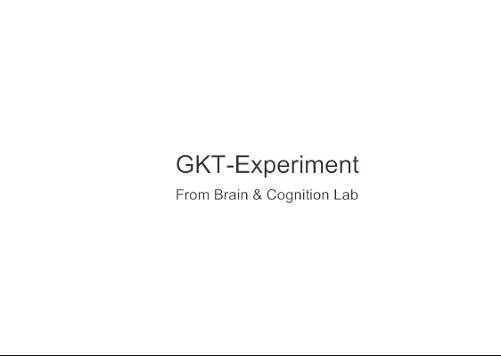
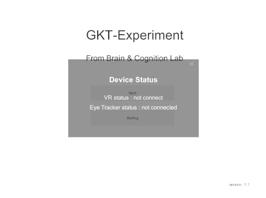
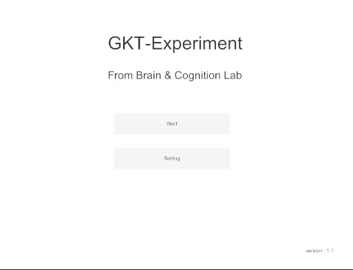
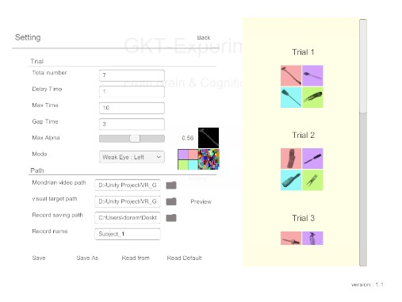
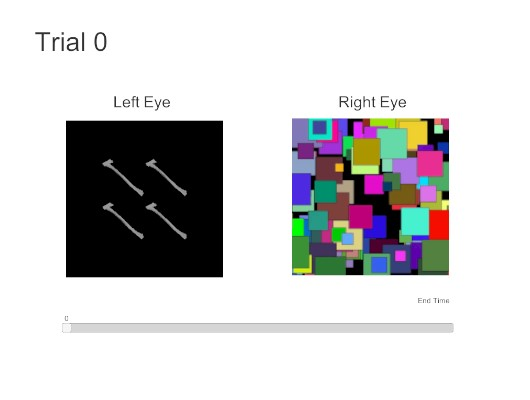

# Unity3D_Psychological_Experiment_GKT

  

<h2> Intro - English </h2>

This is a GKT (Guilty Knowledge Test) Experiment project integrate with Unity3D ,
VR and PupilLab. 
  <ul>
    <li>For more information about Unity3D : (<a href="https://www.google.com/search?q=Unity3D&oq=Unity3D+&aqs=chrome..69i57j0j69i60l3j69i65l3.2267j0j4&sourceid=chrome&ie=UTF-8">link</a>)</li>
    <li>For more information about VR (OpenVR) : (<a href="https://docs.unity3d.com/560/Documentation/Manual/VRDevices-OpenVR.html">link</a>)</li>
    <li>For more information about Pupil Lab : (<a href="https://pupil-labs.com/">link</a>)</li>
  </ul>

<h3>1. Dev documentation : (<a href="#Development">link</a>)</h3>

  if you are <b>Unity developer</b> and want to add some new features ,
you can see the Development part

### 2. Data format intro : [(link)](#Format)

  if you need to analize the exporting data,
you shold check the format introduction of data which created by program

### 3. Preview : [(link)](#View-Preview)

check the program preview to get a better understanding of experiment flow

## SettingEnvironment 

<h3> Add HTC Add-on to your vive </h3>

-- **vive** -- 
 * Step 1 : [Tutorial video](https://www.youtube.com/watch?v=Yu5XwwUHJKg)
 * Step 2 : [Tutorial video](https://www.youtube.com/watch?v=oGcPyWlEZS0)
 * Step 3 : [Tutorial video](https://www.youtube.com/watch?v=nIzuwHagIXQ)
 * Step 4 : [Tutorial video](https://www.youtube.com/watch?v=zswmKmIBrss)
 * Step 5 : Resemble it 
  
  
-- **vive pro** -- [Tutorial video](https://www.youtube.com/watch?v=ZRdWlmxBH30&t=28s)

<h3> HTC vive installation </h3>

you can follow up this tutorial (<a href=https://support.steampowered.com/steamvr/HTC_Vive/>link</a>)
or just open the environment setting at SteamVR 

<h3>HTC Vive setting </h3>
  
please take a look at official tutorial from VIVE ([link](https://www.vive.com/tw/support/vive/category_howto/setting-up-for-the-first-time.html))

<h3>pupil lab capture</h3>
  
Because most of core function of this program is based on the Pupil capture service ,  
you will need to open pupil capture and make sure you have already correctly connect 
HMD Add-on directly to computer.

<h2>View-Preview</h2>
<h3>Title</h3>

  

<h3>Checking Device</h3>

  

<h4>Before step into experiment!!!</h4>

In this section you will need to check if all the device has settele down.

first you need to finished the HTC Vive environment setting. 
next you will need to open the pupil capture software to get connect with.

if you haven't finish the environment setting you can back to the 
tutorial here ([link](#SettingEnvironment))

<h3>Main Menu</h3>

  

<h3>Setting</h3>

    

<h4>Terminology of setting page (and its defalut value) </h4>

1. gapTime (3): the start delay time before fade-in process 
2. maxTime (10): the time span of fade-in process
3. delayTime (1): the end delay time before end this trial
4. maxAlpha (0.5): the maximum alpha value that subject would see , you can see the preview on the right side
5. mode (0): choose which eye is subject's weak eye , mode 0 is the right side ande mode 1 is the left side
6. mondrian video path (./Assets/StreamingAssets/Mondrian): the folder path that mondrian videos locate
7. visual target (./Assets/StreamingAssets/Visual_target): the folder path that visual_target "folders" locate
8. record path (Desktop): the folder that will auto saving every experiment record
9. record name (Subject_1): the name of record folder , the index of the end would auto increment if the system detect there exist a previous record
10. weak eye : the eye that system would auto track and records, this eye will see the visual target
11. strong eye : this eye will see the mondrian video

<h4> Record Data Structure </h4>

for more information please check <a href="#Format">format</a> 
  - recordFolder 
  &ensp;|-ExperimentSetting.json  
  &ensp;|-record.json   
  &ensp;|-001   
  &ensp;&ensp;|-pupil lab reocrd   
  &ensp;|-002   
  &ensp;...   
  &ensp;|-Trial1.csv   
  &ensp;|-Trial2.csv   
  &ensp;...   

<h4> How to set custom visual target </h4>

  first you need to know is the name is matter,
  each folder means each trial of experiment
  each image have a position in visual target
  
  
1. Folder name influence order of experiment : <a href="Assets/StreamingAssets/Visual_target">reference</a>
     
    Please Remember the folder name should start with "Trial" ,
    The computer only reconize the folder which name is start with "Trial" !!!
    these will determine the order of visual target set that subject see 
     
  

  
   
2. Image is sort in alphabetical order
     
    The image name is also important. Because the position of visual target that 
    subject see in the vr is depend on the order of image 
     
    take example : 
     
      the mapping positions of <a href="Assets/StreamingAssets/Visual_target/Trial1">reference<a/> is like below
     
   
   <ul>
    <li>axe : top-left (1st)</li>
    <li>bastinbrush : top-right (2nd)</li>
    <li>boxcutter03a : bottom-right(3rd)</li>
    <li>broom : bottom-left(4th)</li>
   </ul>
   

  

   
    
  
  Key point : 
  <blockquote>
  1. the order of folder : In alphabetical order
   2. the image name influence order and the order influence image position 
  </blockquote>

<h3>Experiment</h3>

  

**1. page intro :**

At this page you can check the time sapn with (time bar) and the view what the subject see also the eye frame visualizer.

**2. Weak Eye and Strong Eye :**  

In this preview the left eye is weak eye and right eye is strong eye.
**Weak Eye** has four visual target and will automatically start fade in when FadeIn Stage start , 
**Strong Eye** has only one video which is mondrian video (produced by this [project](https://github.com/doremi31618/Processing_MondrianPatternGenerator)
 have a look if you need some mondrian video sources)

the visual target image source can change by modifing the visual target path at [setting page](#Setting)
the mondiran video source can also change by modifying the mondiran path at [setting page](#Setting)
both can be found at StreammingAssets path

**3. Experiment Stage :**

* PupilLab Calibration (only execute at very first time) 
* Data Optimize Calibration : this stage will collect the gaze data that subject gaze calibration point
* Start Delay : the stage that before fadin stage 
* FadeIn
* End Delay

## Format

the program can be split to three parts

1. GKT-Experiment : control the experiment process
2. GameManager : Control the UI Event and the interface between GKT-Experiment and GUI Page
3. EyeTracker : 
  * Custom plug-in
  * Pupil HMD Scripts : [link](https://github.com/pupil-labs/hmd-eyes/blob/master/docs/Developer.md#getting-started)

<h2>Format</h2>
<h3>1. Experinment Setting : (JSON)<h3>

  <ul>
    <li>gapTime : the index of experiment</li>
    <li>maxTime: the top-left image name</li>
    <li>delayTime : the top-right image name</li>
    <li>maxAlpha : the bottom-right image name</li>
    <li>trialNumber : the bottom-right image name</li>
    <li>mode : The Recording time span when subject's weak eye saw the visual targets</li>
    <li>mondrian_video_path : The alpha value when subject saw the visual target</li>
    <li>visual_target_path : The alpha value when subject saw the visual target</li>
    <li>recordName</li>
    <li>recordPath</li>
    <li>recordFolderPath</li>
    <li>Calibration Data Format(List, Class : Square Target)
      <ul>
        <li>Rect (xPos,yPos,width,height)</li>
        <li>zPos</li>
      </ul>
    </li>
  </ul>

<h3>2. Experiment Record : (JSON)<h3>

  <ul>
    <li>index : the index of experiment</li>
    <li>top-left : the top-left image name</li>
    <li>top-right : the top-right image name</li>
    <li>bottom-left : the bottom-right image name</li>
    <li>bottom-right : the bottom-right image name</li>
    <li>finishTime : The Recording time span when subject's weak eye saw the visual targets</li>
    <li>finalAlpha : The alpha value when subject saw the visual target</li>
  </ul>

<h3>3. Gaze Data (CSV): </h3>

  <ul>
    <li>confidence : the posibility that pupil lab think it is correct data</li>
    <li>GazeMode : which eye is been record, 0 means right eye , 1 means left eye</li>
    <li>gazePoint3d : the mapping data from eye ball to visual target</li>
    <li>standardCalibrationPoint : the position of calibration point in 3d space</li>
    <li>pupilTimeStamp</li>
    
  </ul>

<h3>4. Pupil Export Data :</h3>

 Check the pupil document (<a href="https://docs.pupil-labs.com/developer/core/recording-format/">link</a>)

## Development

<h3>Technical detail</h3>
