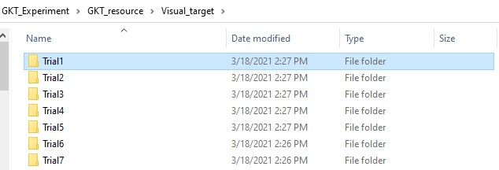
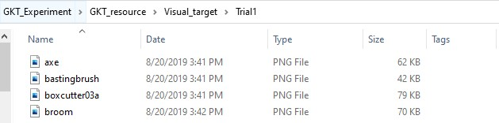
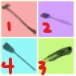

# Unity3D_Psychological_Experiment_GKT

This Experiment is an implementation of guilty knowlegde test (GKT) . it utilize vr (virtual reality) and pupil lab (Eye Tracker) to let experimenter know where is subject looking at but without the subject's awrareness.

For more information about third party document: 
  <ul>
    <li><a href="https://www.google.com/search?q=Unity3D&oq=Unity3D+&aqs=chrome..69i57j0j69i60l3j69i65l3.2267j0j4&sourceid=chrome&ie=UTF-8">Unity3D Officail Document</a></li>
    <li><a href="https://docs.unity3d.com/560/Documentation/Manual/VRDevices-OpenVR.html">VR (OpenVR) document</a></li>
    <li><a href="https://pupil-labs.com/">Pupil Lab</a></li>
  </ul>

Navigator
  <ul> 
    <li><a href="#View-Preview">Preview</a>
    <li><a href="#Format">Data Format Introduction</a>
    <li><a href="#Development">Development documentation</a>
  </ul>

## SettingEnvironment 

<h4> Add HTC Add-on to your vive </h4>

-- **vive** -- 
 * Step 1 : [Tutorial video](https://www.youtube.com/watch?v=Yu5XwwUHJKg)
 * Step 2 : [Tutorial video](https://www.youtube.com/watch?v=oGcPyWlEZS0)
 * Step 3 : [Tutorial video](https://www.youtube.com/watch?v=nIzuwHagIXQ)
 * Step 4 : [Tutorial video](https://www.youtube.com/watch?v=zswmKmIBrss)
 * Step 5 : Resemble it 
  
  
-- **vive pro** -- [Tutorial video](https://www.youtube.com/watch?v=ZRdWlmxBH30&t=28s)

<h4> HTC vive installation </h4>

you can follow up this <a href=https://support.steampowered.com/steamvr/HTC_Vive/>tutorial</a>
or just open the environment setting at SteamVR 

<h4>HTC Vive setting </h4>
  
please take a look at official  [tutorial](https://www.vive.com/tw/support/vive/category_howto/setting-up-for-the-first-time.html) from VIVE

<h4>pupil lab capture</h4>
  
Because most of core function of this program is based on the Pupil capture service 
you will need to open pupil capture and make sure you have already correctly connect HMD Add-on directly to computer.

<h2>View-Preview</h2>
<h3>Title</h3>

  

<h3>Checking Device</h3>

  

Before step into experiment, there something you need to prepare
In this section you will need to check if all the device has settele down.

Step1 : finished the HTC Vive environment setting.  
Step2 : open the pupil capture software to get connect with.  
 if you haven't finish the environment setting you can back to the 
<a href="#SettingEnvironment">tutorial</a>

<h3>Main Menu</h3>

  

<h3>Setting</h3>

    

<h4> Use Custom Setting </h4>

In this page you can custom the experiment setting 
including almost every detail . If you broke the setting and don't remember
the original version, don't worry there are four features you might want to use
<ul>
    <li>save : save current setting to general setting</li>
    <li>save as : save current as a new setting </li>
    <li>boxcutter03a : bottom-right(3rd)</li>
    <li>broom : bottom-left(4th)</li>
   </ul>

<h4> How to set custom visual target </h4>

  first you need to know is the name is matter,
  each folder means each trial of experiment
  each image have a position in visual target
  
  
<b>1. Folder name influence order of experiment :</b><a href="Assets/StreamingAssets/Visual_target">reference</a>
  

    </img>
  

     
    Please Remember the folder name should start with "Trial" ,
    The computer only reconize the folder which name is start with "Trial" !!!
    these will determine the order of visual target set that subject see 
     
    
  

  
   
<b>2. Image is sort in alphabetical order</b>  
  

  
    </
   
    The image name is also important. Because the position of visual target that 
    subject see in the vr is depend on the order of image 
     
    take example : 
     
      the mapping positions of <a href="Assets/StreamingAssets/Visual_target/Trial1">reference</a> is like below
      

         
      

   <ul>
    <li>axe : top-left (1st)</li>
    <li>bastinbrush : top-right (2nd)</li>
    <li>boxcutter03a : bottom-right(3rd)</li>
    <li>broom : bottom-left(4th)</li>
   </ul>
   
   Key point : 
  <blockquote>
  1. the order of folder : In alphabetical order
   2. the image name influence order and the order influence image position 
  </blockquote>
  
  
<b>
  3. Currently only support "png" format image
  </b>  
   I'll develop more image format in the future 
   plese look closely if there is any error in the Visual Target Preview
   it will not record if the image number is incorrect

    
  
  

<h3>Experiment</h3>

  

**1. page intro :**

At this page you can check the time sapn with (time bar) and the view what the subject see also the eye frame visualizer.

**2. Weak Eye and Strong Eye :**  

In this preview the left eye is weak eye and right eye is strong eye.
**Weak Eye** has four visual target and will automatically start fade in when FadeIn Stage start , 
**Strong Eye** has only one video which is mondrian video (produced by this [project](https://github.com/doremi31618/Processing_MondrianPatternGenerator)
 have a look if you need some mondrian video sources)

the visual target image source can change by modifing the visual target path at [setting page](#Setting)
the mondiran video source can also change by modifying the mondiran path at [setting page](#Setting)
both can be found at StreammingAssets path

**3. Experiment Stage :**

* PupilLab Calibration (only execute at very first time) 
* Data Optimize Calibration : this stage will collect the gaze data that subject gaze calibration point
* Start Delay : the stage that before fadin stage 
* FadeIn
* End Delay

<b>4. Record Data Structure</b> 
  as long as you click start experiment button , the system will automatically generate a experiment setting . feel free if you want to cutomize every setting for your subject  
   
  - recordFolder 
  &ensp;|-ExperimentSetting.json  
  &ensp;|-record.json   
  &ensp;|-001   
  &ensp;&ensp;|-pupil lab reocrd   
  &ensp;|-002   
  &ensp;...   
  &ensp;|-Trial1.csv   
  &ensp;|-Trial2.csv   
  &ensp;...   

<h2> Devlopment </h2>

<h3> Program overview </h3>
the program can be split into three parts

1. GKT-Experiment : control the experiment process
2. GameManager : Control the UI Event and the interface between GKT-Experiment and GUI Page
3. EyeTracker :
  * Custom plug-in
  * [Pupil HMD API](https://github.com/pupil-labs/hmd-eyes/blob/master/docs/Developer.md#getting-started)

<h3>Technical detail</h3>

<h2>Format</h2>
<h3>1. Experinment Setting : (JSON)</h3>
<ul>
  <li>gapTime (3): the start delay time before fade-in process </li>
  <li>maxTime (10): the time span of fade-in process</li>
  <li>delayTime (1): the end delay time before end this trial</li>
  <li>maxAlpha (0.5): the maximum alpha value that subject would see , you can see the preview on the right side</li>
  <li>mode (0): choose which eye is subject's weak eye , mode 0 is the right side ande mode 1 is the left side</li>
  <li>mondrian video path (./Assets/StreamingAssets/Mondrian): the folder path that mondrian videos locate</li>
  <li>visual target (./Assets/StreamingAssets/Visual_target): the folder path that visual_target "folders" locate</li>
  <li>record path (Desktop): the folder that will auto saving every experiment record</li>
  <li>record name (Subject_1): the name of record folder , the index of the end would auto increment if the system detect there exist a previous record</li>
  <li>weak eye : the eye that system would auto track and records, this eye will see the visual target</li>
  <li>strong eye : this eye will see the mondrian video</li>
  <li>Calibration Data Format(List, Class : Square Target)
  <ul>
    <li>Rect (xPos,yPos,width,height)</li>
    <li>zPos</li>
  </ul></li>
</ul>

<h3>2. Experiment Record : (JSON)</h3>

  <ul>
    <li>index : the index of experiment</li>
    <li>top-left : the top-left image name</li>
    <li>top-right : the top-right image name</li>
    <li>bottom-left : the bottom-right image name</li>
    <li>bottom-right : the bottom-right image name</li>
    <li>finishTime : The Recording time span when subject's weak eye saw the visual targets</li>
    <li>finalAlpha : The alpha value when subject saw the visual target</li>
  </ul>

<h3>3. Gaze Data (CSV): </h3>

  <ul>
    <li>confidence : the posibility that pupil lab think it is correct data</li>
    <li>GazeMode : which eye is been record, 0 means right eye , 1 means left eye</li>
    <li>gazePoint3d : the mapping data from eye ball to visual target</li>
    <li>standardCalibrationPoint : the position of calibration point in 3d space</li>
    <li>pupilTimeStamp</li>
    
  </ul>

<h3>4. Pupil Export Data :</h3>

 Check the pupil document (<a href="https://docs.pupil-labs.com/developer/core/recording-format/">link</a>)

<h3>Future features</h3>
<ol>
  <li>support more image format</li>
  <li>control experiment process</li>
  <li>support sqlite database</li>
</ol>

